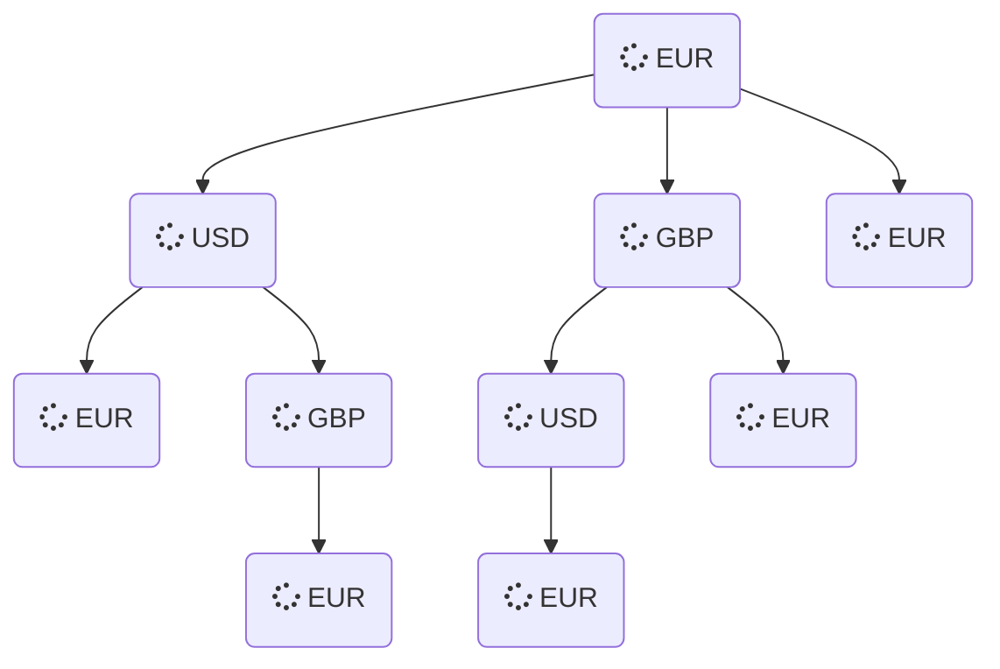

# Démarrage

Ce projet porte sur la création d'une application permettant de trouver un chemin de conversion de devises qui maximise notre bénéfice et minimise le nombre d'étapes. Il utilise l'algorithme Brute Force. Ce projet est achevé, cependant une amélioration peut être faîte sur la création d'une interface pour l'application.


# Énoncé du problème d'arbitrage 

Un arbitrage consiste à utiliser les différences entre les taux de changes pour gagner de l'argent en une monnaie par une série de conversion.
Par exemple :

- 1 euro contre 49 roupies
- 1 roupie contre 2 yen
- 1 yen contre 0.0107 euros

Le chemin total permet de converitir 1 euro en 1.0486 euros. Nos données sont *n* devises et une table *n x n* pour les taux de change. Le problème consiste à déterminer si des séquences d'arbitrages existent, et lesquelles rapportent le plus et lesquelles ont le moins d'étapes.

# Illustration du problème
Pour permettre de mieux comprendre, voici un exemple simplifié du problème avec résolution.
Supposons qu'un établissement de change, dont la principale activité est l'échange immédiat d'une devise contre une autre, propose la conversion de seulement trois devises : l'euro (EUR), le dollar américain (USD) et la livre sterlling (GBP). Voici le tableau récapitulatif des taux de change :

| devise initiale  | EUR             | USD             | GBP             |
| :--------------- |:---------------:|:---------------:|:---------------:|
| EUR              | 1.0             | 1.09            | 0.7             |
| USD              | 0.882           | 1.0             | 0.83            |
| GBP              | 1.21            | 1.45            |  1.0            |

Admettons maintenant qu'un individu se présente dans cet établissement de change afin de convertir 200 euros. Pour rappel, l'objectif est le gain monétaire après avoir effectuer des séries de conversions dont l'ensemble sera nommé cycle. Il ne faut pas qu'une même devise intervienne deux fois dans les séries de conversions (seule la devise du montant initial doit être la même que celle du montant final).

Les cycles possibles sont donc :



Voici maintenant un tableau présentant les cycles possibles dans ce cas (200 euros), le montant des gains, et le montant final à l'issu des séries de conversions :

| cycles possibles                           | gain            | montant final   |
| :-----------------------------------------:|:---------------:|:---------------:|
| EUR &#10132; USD &#10132; EUR              | - 7.724[^1]     | 192.276[^2]     |
| EUR &#10132; GBP &#10132; EUR              | - 30.6          | 169.4           |
| EUR &#10132; USD &#10132; GBP &#10132; EUR | + 18.94         | 218.94          |
| EUR &#10132; GBP &#10132; USD &#10132; EUR | - 20.954        | 179.046         |

[^1]:__calcul du gain__: (200 *x* 1.09 *x* 0.882) - 200

[^2]:__calcul du montant final__: 200 *x* 1.09 *x* 0.882

Plaçons nous maintenant dans le cas où l'établissement de change mettrait en place des frais de transaction sur les conversions de devises.
On fixera les frais de transaction à 3 % du montant final (après conversions).

| cycles possibles                           | gain            | montant convertit  | frais de transaction | choix                                      |
| :-----------------------------------------:|:---------------:|:------------------:|:--------------------:|:------------------------------------------:|
| EUR &#10132; USD &#10132; EUR              | - 7.724         | 192.276            | 5.77[^3]             | EUR &#10132; EUR[^4]                       |
| EUR &#10132; GBP &#10132; EUR              | - 30.6          | 169.43             | 5.083                | EUR &#10132; EUR                           |
| EUR &#10132; USD &#10132; GBP &#10132; EUR | + 18.94         | 218.94             | 6.568                | EUR &#10132; USD &#10132; GBP &#10132; EUR |
| EUR &#10132; GBP &#10132; USD &#10132; EUR | - 20.954        | 179.046            | 5.371                | EUR &#10132; EUR                           |

[^3]:__calcul des frais de transaction__: 200 *x* 1.09 *x* 0.882 *x* 0.03

[^4]:__explication du choix__: si le montant final après déduction des frais de transaction est inférieur au montant initial, il n'est pas rentable d'effectuer la conversion.


# Méthodologie des librairies
Pour résoudre ce problème de conversion de devises, nous avons créer plusieurs librairies avec leurs tests correspondants.

Librairie **lib_donnees.py**
> Permet d'initialiser les données nécessaires pour résoudre notre problème : la devise à convertir choisie par l'utilisateur, le montant à convertir choisi également par l'utilisateur, ainsi que la liste de devises existantes et les taux de change associés. 

Librarie **lib_dictionnaire.py**
> Permet de transformer nos données en un objet dictionnaire (deux dictionnaires imbriqués faisant référence à une table *n x n*) que l'on explorera par la suite.

Librairie **lib_solution.py**
> Permet de résoudre notre problème. On cherche dans un premier temps les cycles de conversions possibles. On isole ensuite le cycle le plus rentable d'un point de vue du gain d'argent. Puis, on renvoie le chemin le plus rentable avec le montant initial et le montant après conversion. On peut aussi effectuer cette dernière étape dans le cas où des frais de transaction rentreraient en compte.

Librairie **lib_affichage.py**
> Permet de paramétrer l'affichage du résultat obtenue par la résolution du problème.


# Utilisation de l'application
Les listes de devises et de taux de change sont directement importées d'un fichier `json` nommé **donnees.json**. Il est important pour le bon fonctionnement de l'application que ce fichier `json` contienne la liste de devises existantes nommée ***devises*** ainsi que la liste de taux change nommée ***taux***.
1. Ouvrir un terminal puis utiliser le package `pip` pour intaller `poetry`, `pyserde`, `typer`, `rich` si cela n'est pas déjà fait :
```bash
pip install poetry
pip install pyserde
pip install typer
pip install rich
```

2. Exécuter ensuite la ligne de commande suivante afin de visualiser les commandes possibles de notre application. En l'occurence, ici devront apparaître `fichier`, `calcule` et `calculefrais`.
```bash
poetry run python -m final --help
```
Si tout fonctionne correctement, le message suivant devrait apparaître :
```bash
Usage: python -m final [OPTIONS] COMMAND [ARGS]...

Options:
  --install-completion  Install completion for the current shell.
  --show-completion     Show completion for the current shell, to copy it or
                        customize the installation.
  --help                Show this message and exit.

Commands:
  calcule
  calculefrais
  fichier
```

3. Enfin, exécuter les lignes de commande ci-dessous pour faire fonctionner l'application :
```bash
poetry run python -m final fichier test.json
```
Les messages suivants devraient alors apparaître :
```bash
Quelle devise voulez-vous convertir ? 
Quel est votre montant de départ ?
```
Il suffit alors d'écrire le nom de la devise voulant être convertie (elle doit exister dans la liste de devises du fichier **donnees.json** et être écrite sans guillemets) et le montant à convertir.

```bash
poetry run python -m final calcule test.json
```
Qui doit renvoyer un message de ce type si l'on choisit la devise CAD (dollar canadien) et le montant 1500 :
```bash
Le montant de départ est de : 1500.0 CAD 
Le montant est maintenant de : 1508.06581 CAD
Le chemin sélectionné est : ['CAD', 'JPY', 'GBP', 'EUR', 'CAD']
```

```bash
poetry run python -m final calculefrais test.json
```
Avec pour résultat, si on choisit la devise CAD (dollar canadien) et le montant de départ 1500:
```bash
Le montant de départ est de : 1500.0 CAD 
Avec les conversions, le montant est passé à : 1508.06581 CAD
Les frais s élèvent à : 45.0 CAD
Le montant est maintenant de : 1500.0 CAD
Le chemin sélectionné est : ['CAD', 'CAD']
```

# Auteurs 
- Manon Valliot (https://github.com/ManonValliot)
- Merve Yildirim (https://github.com/MerveYldm)
- Anne-Sophie Nunes (https://github.com/Anne-SophieNUNES)
